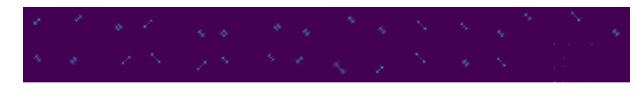
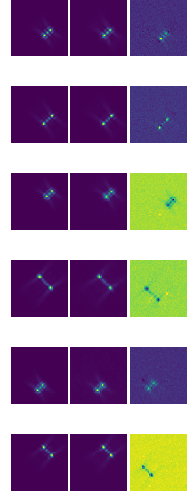

# A Deep Convolutional Encoder-Decoder Network for Blind Source Separation in Fluorescence Microscopy Images

  

## Introduction
In fluorescence microscopy, a great number of experiments require the ability to identify and localize single fluorescent particles at the nanometer scale.
However, images may contain highly overlapped emitters and a separation is essential for precise localization. 
In this project, we are interested in the separation of point source images from the Tetrapod PSFs family [1]. After precise separation is achieved, known 3D localization techniques may be applied. In this manner, accurate localization of overlapped PSFs can be accomplished.
The fluorescent particle (emitter) separation problem is treated in two stages. First, we tackle the problem by estimating the linear transformation given by independent component analysis (ICA). Second, we propose a deep convolutional neural network (CNN) approach and apply it to the source separation problem. 

## Architecture
The model is implemented as an encoder-decoder network, comprised of a convolutional network part, which acts as a feature extractor and a deconvolutional network part, which produces a source separation of images from the extracted features. 
The input layer size is 64x64x64, for 64 frames in each video input sample, and the output layer is 64x64x32 since each sample was generated with a maximum of 32 sources.

## Results

  

## References
[[1]](https://pubs.acs.org/doi/10.1021/acs.nanolett.5b01396) *Y. Shechtman, L. E. Weiss, A. S. Backer, S. J. Sahl, and Moerner W. E. “Precise Three-Dimensional Scan-Free Multiple-Particle Tracking over Large Axial Ranges with Tetrapod Point Spread Functions"*
